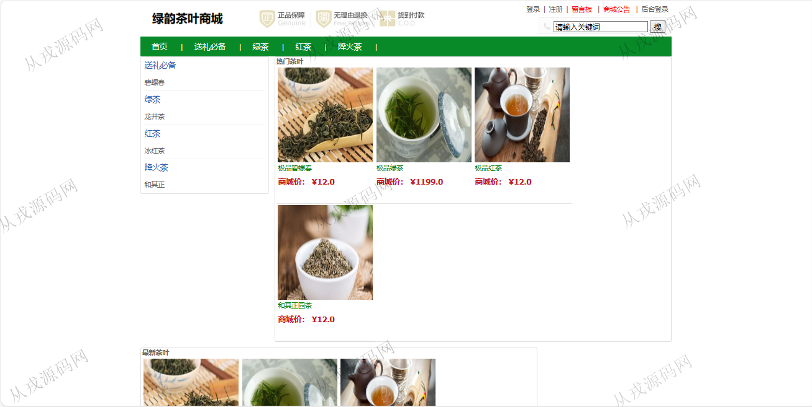
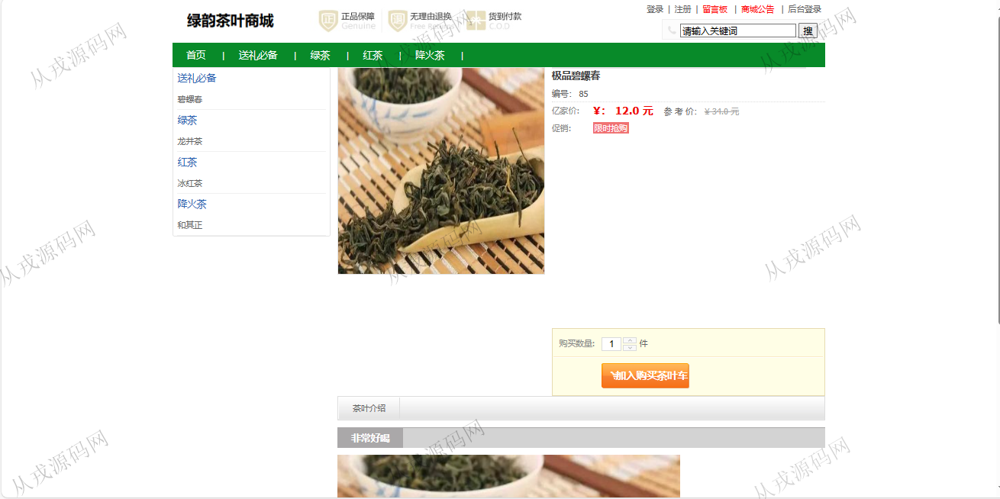
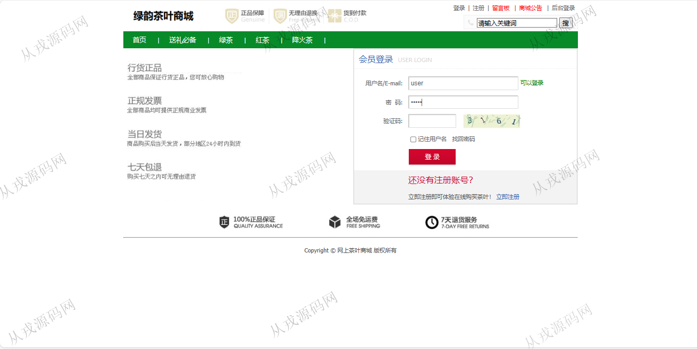
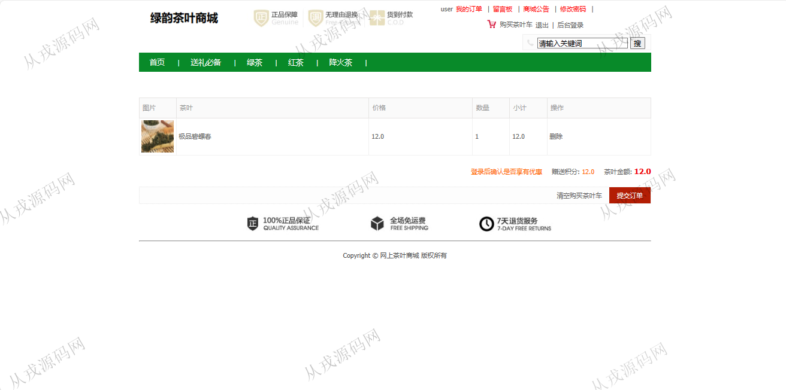
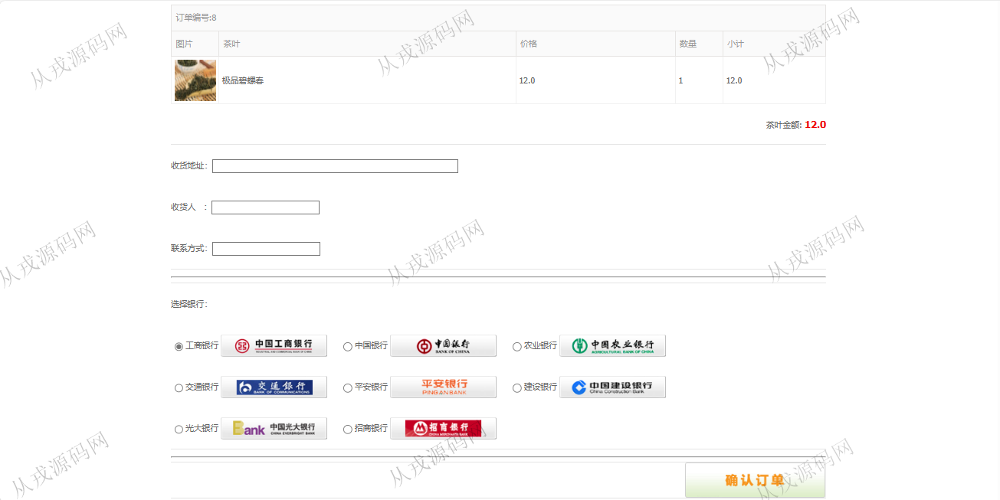
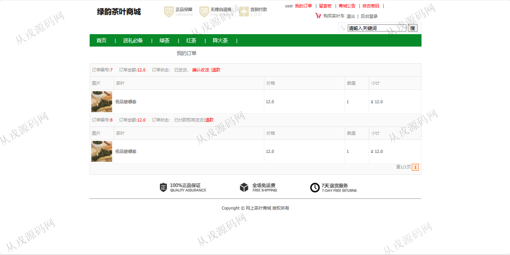
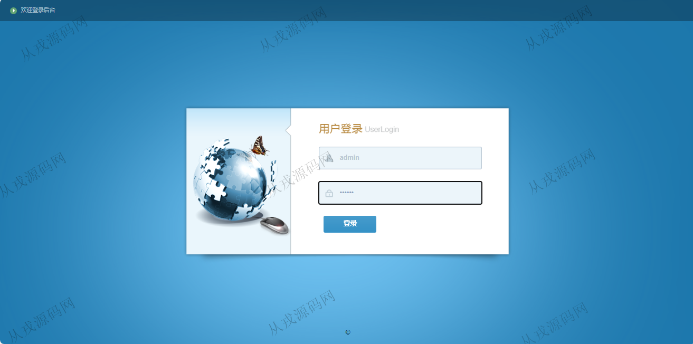
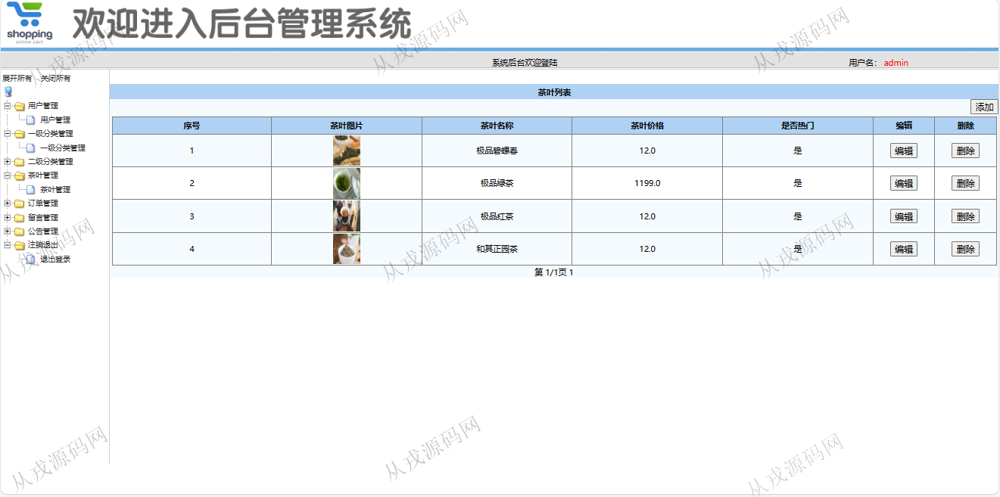
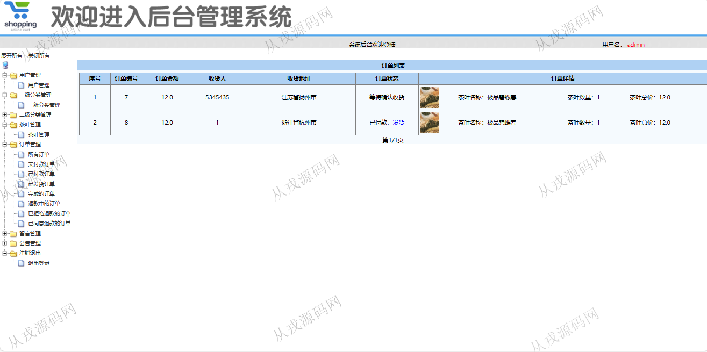

<h1 align="center">223.茶叶商城管理系统</h1>

 获取sql文件 QQ: 386869957 QQ群: 377586148 

 [更多源码项目: 从戎源码网](https://armycodes.com/) 

## 简介

> 本代码来源于网络,仅供学习参考使用!
>
> 提供1.远程部署/2.修改代码/3.设计文档指导/4.框架代码讲解等服务
> 
> 用户端访问地址：http://localhost:8080/
> 
> 用户：user 123456
> 
> 管理后台：http://localhost:8080/admin.action
> 
> 管理员：admin 123456
>

## 项目介绍
基于ssm的茶叶商城管理系统：前端 jsp、jquery，后端 springmvc、spring、mybatis；角色分为管理员、用户；集成茶叶浏览、购物车、在线付款、我的订单等功能于一体的系统。

## 功能介绍

### 用户

- 基本功能：登录，注册，退出，密码修改
- 网站首页：主导航栏，全局搜索，分类导航，最新茶叶展示
- 茶叶购买：茶叶列表展示，茶叶详情，加入购物车，购物车列表，提交订单，填写收货地址，在线付款（模拟）
- 我的订单：订单列表查询，确认收货，退款
- 其它功能：留言板，商城公告

### 管理员

- 用户管理：用户信息的增删改查，也可以由用户在前台自行注册
- 分类管理：一级分类信息的增删改查，二级分类信息的增删改查，二级在一级下面创建
- 茶叶管理：茶叶信息的增删改查，茶叶图片上传
- 订单管理：订单信息了列表查询，发货，退款操作
- 留言管理：查询用户的留言信息，删除操作
- 公告管理：公告信息的增删改查

## 环境

- <b>IntelliJ IDEA 2021.3</b>

- <b>Mysql 5.7.26</b>

- <b>Tomcat 7.0.73</b>

- <b>JDK 1.8</b>

## 运行截图

